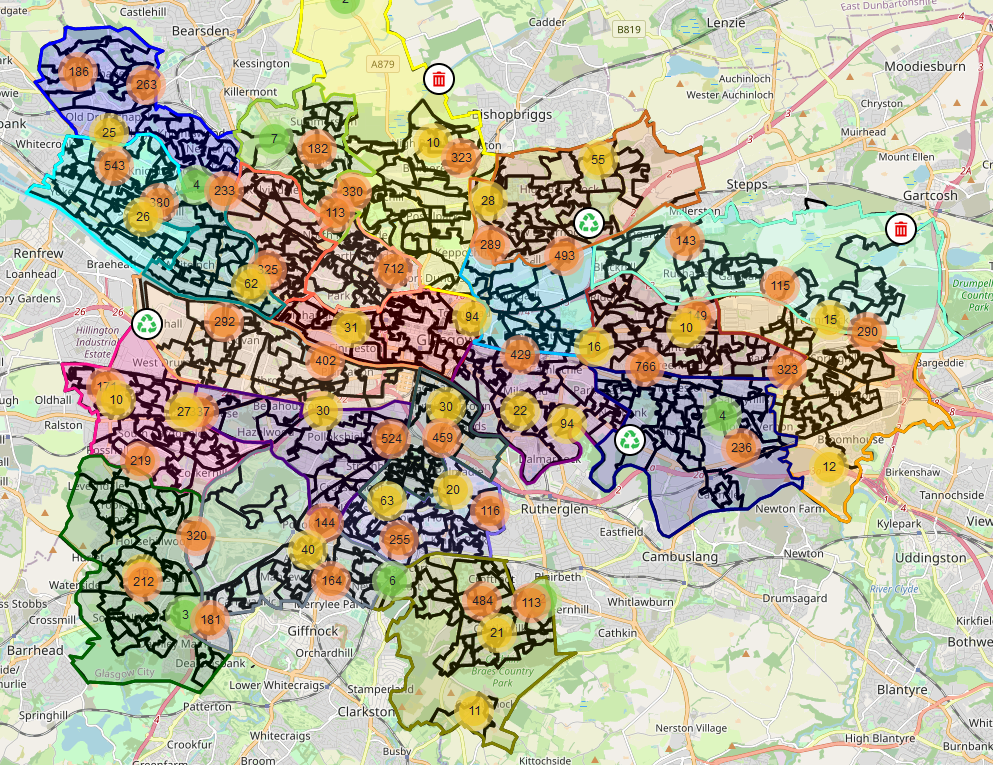

# Glasgow Litter 🚯

A research project that explores the relationships between deprivation and litter in Glasgow City.



## Objectives

1. Identify the relationships between the key indicators of deprivation in areas of
   Glasgow City and the amount of litter on its streets.
2. Discover if an automated approach to counting litter on a city scale could be achieved using deep learning object detection methods.

## Data

The project's data sources can be found in the `data` directory and are described in [DATA.md](docs/DATA.md).

## App

A companion [web application](https://glasgow-litter.garyblackwood.co.uk) is included that allows users to interactively explore the litter objects detected throughout the city.

More information can be found in [APP.md](docs/APP.md).

## Object Detection

The notebooks in the `models/yolov5` directory are used to develop YOLOv5s object detection models for the purposes of litter detection.

Similarly, the notebooks in the `models/detectron2` directory are used to train Faster R-CNN models with the same objective.

## Regression

The notebook in the `regression` directory applies count data regression models such as Poisson and Negative Binomial to the extended SIMD data set described in [DATA.md](docs/DATA.md).

## Clone

This repository contains two submodules as dependencies. Use the following command to clone this repository and the submodules it references:

```bash
# If you're cloning for the first time.
git clone --recurse-submodules https://github.com/Garee/glasgow-litter.git

# If you have already cloned the repository.
git submodule update --init --recursive
```

## Dependencies

1. [Python 3.9.6](https://www.python.org/downloads)
2. [CUDA Toolkit 11.3](https://developer.nvidia.com/cuda-11.3.0-download-archive)
3. [PyTorch 1.11.0](https://pytorch.org/get-started/locally/) for YOLOv5 models
4. [Detectron2](https://detectron2.readthedocs.io/en/latest/tutorials/install.html) for Faster R-CNN models

```bash
# Create the virtual environment
python -m venv venv

# Activate the virtual environment
source venv/Scripts/activate # source venv/bin/activate # linux/macOS

# Install dependencies
pip install -r requirements.txt

# If you want to use yolov5
pip install -r models/yolov5/yolov5/requirements.txt
```

Open the object detection and regression notebooks in [Visual Studio Code](https://code.visualstudio.com/docs/datascience/jupyter-notebooks) or [JupyterLab](https://jupyter.org/install).

## Scripts

There are utility scripts within the `scripts` directory that can be used for data collection and preparation.

More information can be found in the header comment of each script.

## Report

The source code for the report can be found in the `report` directory. This is currently a work in progress.

## Acknowledgements

Image annotations were added using [Label Studio](https://labelstud.io/).

Image augmentations were applied using [Roboflow](https://roboflow.com/features#transform).

Icons sourced from [iconmonstr](https://iconmonstr.com/license/).
