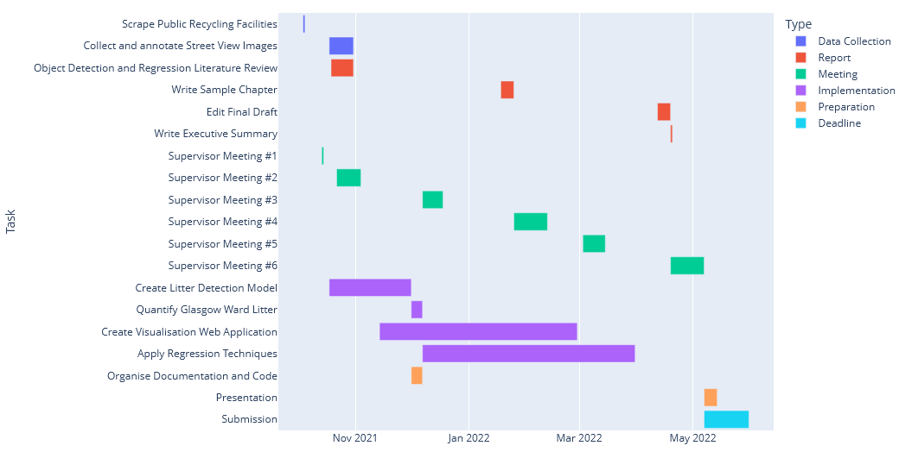

# Project Plan

This Gantt chart was produced by `python scripts/plot_plan.py`

## Report

Progress will be made on writing the report throughout the year. It will be an incremental and iterative process that takes place alongside the project implementation.

## Data Sources

The data sources are described in [DATA.md](./DATA.md).

## Literature Review

| Topic            | Resource                                                                                                                                                                                      | Type           |
| ---------------- | --------------------------------------------------------------------------------------------------------------------------------------------------------------------------------------------- | -------------- |
| Object Detection | [TACO: Trash Annotations in Context for Litter Detection](https://arxiv.org/abs/2003.06975)                                                                                                   | Paper          |
| Object Detection | [Mask R-CNN](https://arxiv.org/abs/1703.06870)                                                                                                                                                | Paper          |
| Object Detection | [Faster R-CNN](https://arxiv.org/abs/1506.01497v3)                                                                                                                                            | Paper          |
| Object Detection | [Splash of Color: Instance Segmentation with Mask R-CNN and Tensorflow](https://engineering.matterport.com/splash-of-color-instance-segmentation-with-mask-r-cnn-and-tensorflow-7c761e238b46) | Blog           |
| Object Detection | [matterport/Mask_RCNN](https://github.com/matterport/Mask_RCNN)                                                                                                                               | Software       |
| Object Detection | [facebookresearch/Detectron](https://github.com/facebookresearch/Detectron)                                                                                                                   |
| Software         |
| Object Detection | [TrashNet](https://github.com/garythung/trashnet)                                                                                                                                             | Paper/Software |
| Image Annotation | [Trash Annotations in Context Dataset](http://tacodataset.org/)                                                                                                                               | Website        |
| Image Annotation | [superintendent](https://superintendent.readthedocs.io/en/latest/active-learning.html)                                                                                                        | Software       |
| Image Annotation | [LabelImg](https://github.com/tzutalin/labelImg)                                                                                                                                              | Software       |
| Deprivation      | [Scottish Index of Multiple Deprivation 2020](https://www.gov.scot/publications/scottish-index-multiple-deprivation-2020/)                                                                    | Publication    |
| Litter           | [Scotland's Litter Problem](https://www.zerowastescotland.org.uk/sites/default/files/Scotland%27s%20Litter%20Problem%20-%20Full%20Final%20Report.pdf)                                         | Report         |
| Litter           | [Time for a new approach to tackling litter](https://www.keepscotlandbeautiful.org/media/1566897/leq-2020-report-final-041220.pdf)                                                            | Report         |
| Regression       | [An Introduction To Statistical Learning](https://www.statlearning.com/)                                                                                                                      | Book           |
| Regression       | [The Elements of Statistical Learning](https://web.stanford.edu/~hastie/ElemStatLearn/)                                                                                                       | Book           |
| Regression       | Predictive Modelling, Advanced Predictive Models, Machine Learning II                                                                                                                         | Course Notes   |
